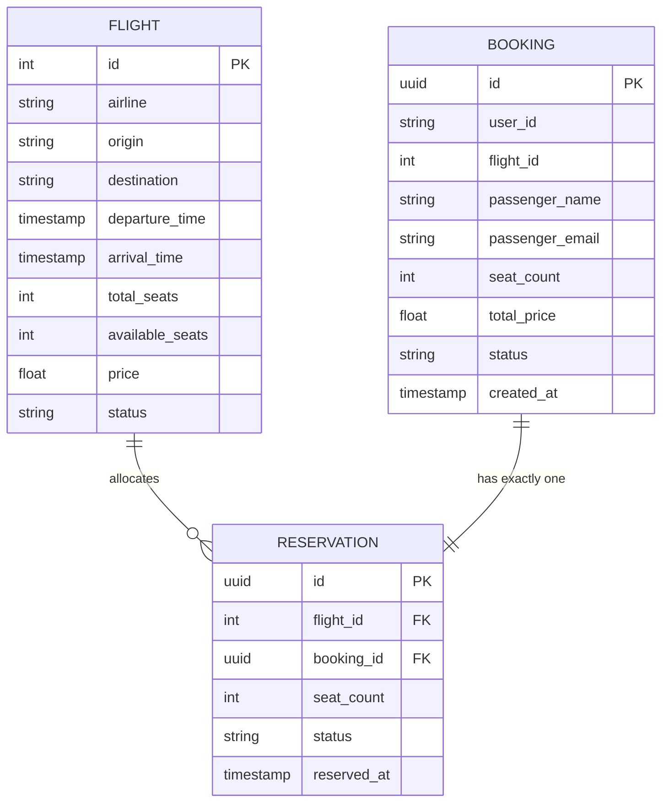

## ER Diagram

```mermaid
erDiagram
    FLIGHT {
        int id PK
        string airline
        string origin
        string destination
        timestamp departure_time
        timestamp arrival_time
        int total_seats
        int available_seats
        float price
        string status
    }

    BOOKING {
        uuid id PK
        string user_id
        int flight_id
        string passenger_name
        string passenger_email
        int seat_count
        float total_price
        string status
        timestamp created_at
    }

    RESERVATION {
        uuid id PK
        int flight_id FK
        uuid booking_id FK
        int seat_count
        string status
        timestamp reserved_at
    }

    FLIGHT ||--o{ RESERVATION : "allocates"
    BOOKING ||--|| RESERVATION : "has exactly one"
    %% NOTE: {airline, flight_number, departure_date} is UNIQUE
```