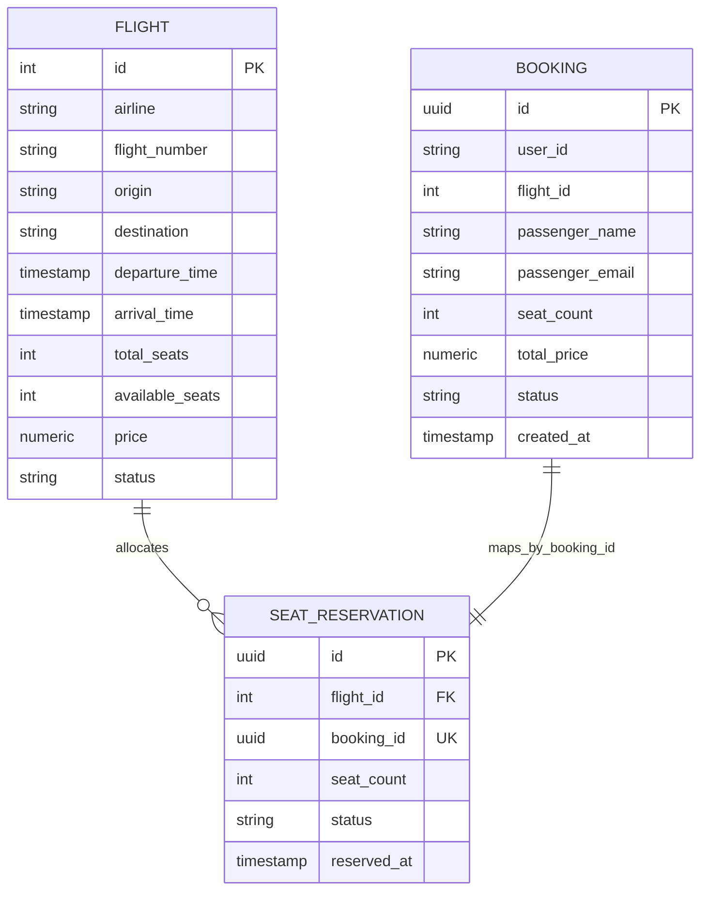

# Flight Booking: gRPC + Redis

Проект состоит из двух микросервисов:

- `booking-service` — REST API + PostgreSQL
- `flight-service` — gRPC API + PostgreSQL + Redis Sentinel

Межсервисное взаимодействие выполняется по gRPC.

## Архитектура

```text
Client (REST)
   |
   v
Booking Service  ---------------------->  Flight Service (gRPC)
  PostgreSQL                                  PostgreSQL
                                              Redis master/replicas
                                              Redis Sentinel x3
```

## Быстрый старт

```bash
docker compose up -d --build
docker compose ps
```

Порты:

- Booking REST API: `http://localhost:8000`
- Flight gRPC: `localhost:50051`
- Flight DB: `localhost:5433`
- Booking DB: `localhost:5434`
- Redis Sentinel: `localhost:26379`, `26380`, `26381`

## gRPC контракт

Файл контракта: `proto/flight/v1/flight.proto`

Сервис `FlightService`:

- `SearchFlights`
- `GetFlight`
- `ReserveSeats`
- `ReleaseReservation`

В контракте используются:

- `google.protobuf.Timestamp`
- `enum FlightStatus`
- `enum ReservationStatus`

## REST API (Booking Service)

- `GET /flights?origin=SVO&destination=LED&date=2026-04-01`
- `GET /flights/{id}`
- `POST /bookings`
- `GET /bookings/{id}`
- `POST /bookings/{id}/cancel`
- `GET /bookings?user_id=X`

## Модель данных



Ограничения в миграциях:

- `total_seats > 0`
- `available_seats >= 0`
- `available_seats <= total_seats`
- `price > 0`
- `arrival_time > departure_time`
- `seat_count > 0`
- `status` через `CHECK`
- уникальность `(flight_number, DATE(departure_time))`

## Ключевые технические решения

- Миграции БД: `Flyway`
- Транзакции и блокировки: `SELECT ... FOR UPDATE`
- Auth между сервисами: API key в gRPC metadata
- Кеширование: Cache-Aside в Redis
- Отказоустойчивость Redis: Sentinel (1 master, 2 replicas, 3 sentinel)
- Retry: до 3 попыток, backoff `100/200/400ms`, только для `UNAVAILABLE/DEADLINE_EXCEEDED`
- Circuit Breaker: `CLOSED -> OPEN -> HALF_OPEN`

## Проверка проекта

Основной скрипт проверки:

```bash
bash test_requests.sh
```

Скрипт проверяет:

- базовые REST/gRPC сценарии
- создание/отмену бронирования
- транзакционный rollback на ошибках
- idempotency `ReserveSeats` по `booking_id`
- auth (`UNAUTHENTICATED` при неверном ключе)
- cache hit/miss + TTL + invalidation
- retry + отсутствие retry для `RESOURCE_EXHAUSTED`
- Redis Sentinel quorum
- Circuit Breaker переходы состояний